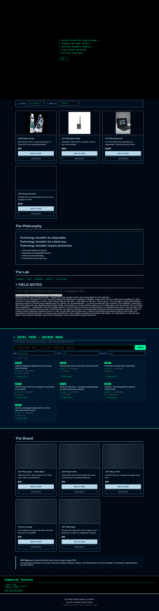

# 1337 Wing

Self-hosted full-stack e-commerce platform for the 1337 Wing brand — React/TypeScript frontend, Node/Express backend, PostgreSQL, deployed on self-managed Linux infrastructure.

**[Live Demo](https://1337wing.taila4d3fb.ts.net/) · [GitHub](https://github.com/agentred1999/1337-Wing)**

## Preview



## Why I Built It

1337 Wing started from the idea that technology shouldn't be disposable, shouldn't be a black box, and shouldn't require permission to understand or modify. I wanted a project that didn't stop at the UI — a real storefront with authentication, checkout, payments, and email, backed by infrastructure I provisioned, hardened, and run myself, not a managed platform.


## Features

- Product browsing, product detail pages, cart with quantity management
- User accounts: signup, login, JWT (cookie-based) auth, forgot/reset password via email
- Guest checkout (no account required to purchase)
- Stripe-powered checkout and payment processing, with webhook handling
- Contact form
- Live Hacker News "Intel Feed" (HN Firebase API + Algolia search)


- Night / day theming with a custom "glowlight" mode
- One-time boot sequence on first visit
- Dedicated feature page (`/thinkpad-701c`) with a custom animated hero
- Security and Privacy policy pages
- Automated test coverage on cart logic (Vitest)

## Product Catalog

The storefront itself sells functional hardware, not apparel-first merch — in line with a hardware-first, Hak5-style brand direction:


| Product | Price | Description |
|---|---|---|
| 1337 Wing Mesh Node | $200 | Meshtastic LoRa node for encrypted, internet-free communication |
| 1337 Wing Revenant | $1,000 | Linux-first laptop, fully repairable and upgradeable, ThinkPad-inspired chassis |
| USB Rubber Ducky | $80 | HID injection device running DuckyScript 3.0, ships with a demo payload preloaded |
| 1337 Wing Cyberdeck | $300 | Portable Kali Linux ARM platform built around a Raspberry Pi CM4 |

## Technology Stack

**Frontend:** React · Vite · TypeScript · Vitest
**Backend:** Node.js · Express
**Database:** PostgreSQL
**Payments:** Stripe (checkout + webhooks)
**Email:** Resend (password reset flow)
**Auth:** JWT (httpOnly cookie), bcrypt password hashing
**Infrastructure:** Linux (Raspberry Pi 5) · Caddy · systemd · Tailscale · UFW

## Architecture

```
Browser
   │
   ▼
Caddy (reverse proxy, TLS, security headers)
   │
   ├──▶ React / Vite frontend (static build)
   │
   ▼
Express API
   │  ├─ auth (JWT cookie, bcrypt)
   │  ├─ products / orders / guest checkout
   │  ├─ payments (Stripe checkout + webhooks)
   │  ├─ password reset (Resend email)
   │  └─ contact
   ▼
PostgreSQL
```

Backend structure:
```
backend/
├── controllers/   # auth, products, orders, payments, passwordReset, users, contact, server
├── routes/        # one route file per controller
├── middleware/     # auth, validators, rateLimiter, errorHandler
├── database/       # schema.sql + incremental migrations (orders, guest checkout,
│                    #   password reset, products content, stripe)
└── server.js
```

See [`docs/architecture.md`](docs/architecture.md) for a deeper breakdown of each layer and the security model behind it.

## Security

- JWT authentication via httpOnly cookie (not localStorage)
- bcrypt password hashing
- Rate limiting on auth and public endpoints
- Parameterized queries throughout — no string-built SQL
- Server-side input validation on all mutating routes
- Stripe webhook signature verification
- Password reset tokens are hashed before storage and time-limited (30 min TTL) — the raw token is never stored, only its hash
- Centralized error handling — no stack traces or internals leak to clients
- SSH key-only authentication on the host, UFW default-deny firewall
- All secrets loaded from environment variables — see `backend/.env.example` for required keys (values intentionally blank)

### Security Audit

Ran a full security pass across the stack before considering it production-ready, rather than assuming defaults were safe. The live results are published on the site itself at [`/security`](https://1337wing.taila4d3fb.ts.net/security):

**Infra**
- Caddy reverse proxy bound to `127.0.0.1`, sitting in front of the app
- HSTS + standard security headers applied on every response
- TLS terminated at the edge, gzip enabled

**Auth**
- Passwords hashed with bcrypt, cost factor 12
- JWT-based sessions, rate limited on auth endpoints
- Found and fixed a timing side-channel in the login comparison (a nonexistent username responded faster than a wrong password — enough to enumerate valid usernames without ever guessing one)

**Data**
- Parameterized queries everywhere — no string-built SQL
- Nightly PostgreSQL dumps, 14-day rotation, encrypted at rest

**Ops**
- SSH locked to key-only auth, password login disabled entirely, scoped to a private network overlay rather than the raw internet
- UFW configured default-deny inbound

Also confirmed as part of the same pass: Stripe webhook signatures are verified before any webhook payload is trusted, and password reset tokens are hashed before storage with a 30-minute expiry.

A full field-note writeup of this audit — written as it happened, not after the fact — is published at [`/#mission`](https://1337wing.taila4d3fb.ts.net/#mission) under "Field Notes."


### Accessibility

Audited the site for ADA/WCAG-aligned accessibility rather than treating it as an afterthought:

- Skip-to-content link for keyboard and screen reader users
- Cart modal traps focus, closes on Escape, restores focus on close
- Icon-only buttons carry explicit `aria-label`s; all form inputs are labeled
- Live regions announce cart updates without a full page reload
- Animations respect `prefers-reduced-motion`
- Verified with a Lighthouse accessibility audit in Chrome headless

## Deployment

- Self-hosted on a **Raspberry Pi 5**, frontend and backend run as independent processes managed via start/stop scripts (systemd-compatible)
- Caddy reverse proxy handles TLS termination and routing, bound to localhost
- Tailscale provides secure remote access and public exposure without router port-forwarding
- Nightly PostgreSQL backups with rotation

## Local Development

```bash
# backend
cd backend
npm install
cp .env.example .env   # fill in your local DB credentials, JWT secret, Stripe/Resend keys
npm run dev

# frontend
cd frontend
npm install
npm run dev
```

## Testing

```bash
cd frontend
npm test          # single run
npm run test:watch
```

## What I Would Improve

- Move off the current network path onto a dedicated domain + CDN for consistent latency
- Add CI (lint/test/build) ahead of every deploy instead of manual verification
- Expand automated test coverage from cart logic into the API layer (auth, orders, payments)

## Future Development

- Broader test coverage across the backend
- Domain + CDN migration
- Product-line expansion toward functional hardware, in line with the brand's hacker/cybersecurity identity

## License

No license specified yet.
